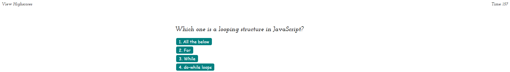
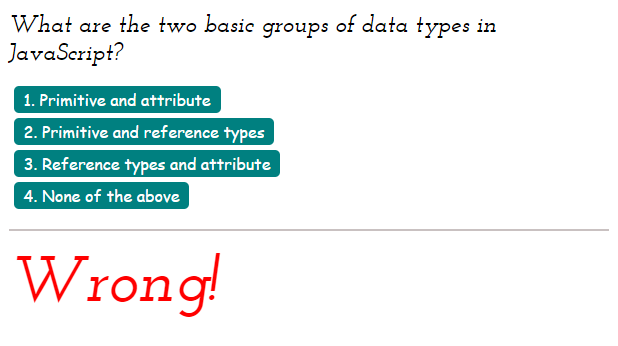
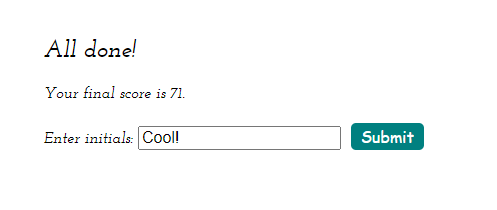
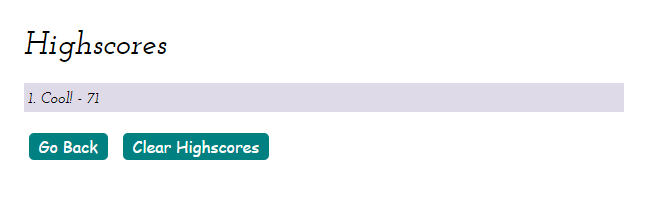

# Project: Code-Quiz

  Deployable Link - > https://bunix25.github.io/Code-Quiz/

## Table of Contents: 
- [Project:Code Quiz](#project-code-quiz)
  - [Table of Contents:](#table-of-contents)
  - [License:](#license)
  - [Description:](#description)
  - [Installation Instructions:](#installation-instructions)
  - [Test Command:](#test-command)
  - [Github:](#github)
  - [My Email Address:](#my-email-address)
  - [Other Contributors:](#other-contributors)
  - [Images:](#images)

## License:

## Description:
A typical coding assessment is a combination of multiple-choice questions and interactive coding challenges.

## Installation Instructions: 
Launch site in default browser.

## Test Command: 
To test type Click "Start Quiz" and answer questions. into the terminal

## Github: 
Check out more projects on my Github at https://github.com/Bunix25

## My Email Address:
If you have any questions please feel free to email me at Svattt7@gmail.com

## Other Contributors:
None at this time.

## Images:

